## What has changed based on the final proposal (2 pt.)

**Did your dataset change? If so, why?**

We have switched to a different dataset due to difficulties extracting the expression data from our original dataset.  The original dataset was in the form of a 61GB (uncompressed) HDF5 file, which contained one expression matrix that was too large to load into R without extensive subsetting.  Our new dataset is also an scRNA-seq from COVID-19 patients but is much more manageable and can easily be extracted with getGEO(). 
Our new dataset is GSE157344, which corresponds to a Nature Communications paper from March 5 called Deciphering the state of immune silence in fatal COVID-19 patients.  It contains single cell transcriptomics data from patients with mild or severe COVID-19 disease as well as from healthy controls.  The data is from immune cells isolated from peripheral blood samples of all cases and controls, as well as bronchoalveolar lavage fluids from the severe cases.  The metadata contains age, disease outcome, disease severity, comorbidities, sex, and sample type features.  There are 54 samples in total, from 21 severe and 6 mild patients and 5 controls.  Each sample has [LIST DIMS]; over 150,000 cells are represented in total.

**Have you decided to do a different analysis than what was mentioned in your proposal? If so, Why?**

Our aims for this project have changed to reflect the features of the new dataset.  The overall goal is to determine how (if at all) the immune response to SARS-CoV-2 infection differs between male and female patients and between patients of varying ages, based on differential expression analysis of single cell data.  If significant transcriptomic differences between the sexes can be seen from the data, this could have implications for vaccination protocols and treatment procedures.  In order to characterize sex differences in immune response, we have four aims:

1. Determine the top differentially expressed genes between male and female patients with mild and severe disease.
2. Determine the top differentially expressed genes in each immune cell type cluster between male and female patients and controls.
3. Determine the top differentially expressed genes in each sample type (peripheral blood vs lavage fluid) between male and female patients with severe disease.
4. Determine whether patient age affects differential expression in each sample type (peripheral blood vs lavage fluid) between male and female patients with severe disease.

**Are there any changes in task assignments of group members?** 
The updated division of work strategy is:

| Name        | Tasks           |
| ------------- |:-------------:|
| Jackson      | Aim 1, data cleaning |
| Yilin     |   Aim 2, data collection    |
| Trevor |   Aim 3, data visualization    |   
| Madeline |   Aim 4, data validation    |   

## What is the progress of the analyses (4 pts.)

We used two male samples (BAL7 and BAL27) and two female samples (BAL6 and BAL3) just to test out the mechanics of our workflow.  The full set of 54 samples will be included in the final analysis. We also downloaded, compiled, and processed metadata for all samples. Metadata included COVID severity status, sex, and patient ID for each of the 54 samples.

For Aims 1-3, our goal is to identify the genes that are differentially expressed across different conditions. In order to do this, we first load each sample dataset and create a Seurat object for each one. Then, each Seurat object goes through a standard pre-processing workflow, including quality control filtering and normalization. We filtered cells with unique feature/gene counts that were less than 200 or greater than 2,500, and filtered cells with greater than 5% mitochondrial counts. Next, we normalized the sample data using a “LogNormalize” method, which normalizes expression measurements by total expression, multiplies the normalized values by a scale factor, and then log-transforms the result of that. Because we have 54 samples that all need the same preprocessing, we created an automated script that will filter and normalize each sample the same way.  

Example preprocessing plots for two samples are below:

**BAL7 (Male, Severe COVID, lung lavage):** 
Prefiltering. Violin plots of nFeature, nCount, and percentage of mitochondrial gene transcripts from each cell:

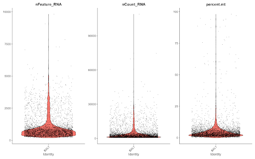
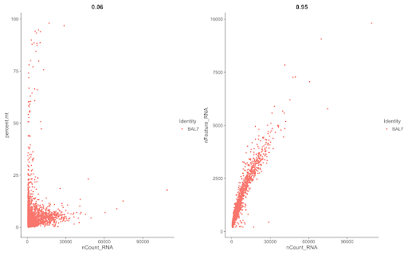 
After applying the filter: plots for all cells with less than 15% mitochondrial genes, and all unique genes expressed between 200 and 4000 counts.

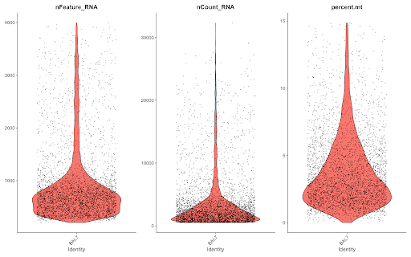
Feature selection: the figure on the right labels the top 10 genes that are highly variable across different cells in the BAL7 sample:
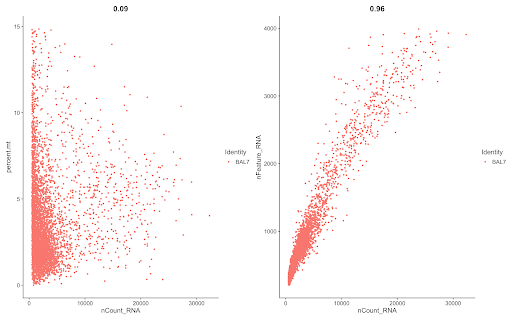

**BAL3 (Female, Severe COVID, lung lavage):** 
Pre-filtering, same plots as for BAL7:
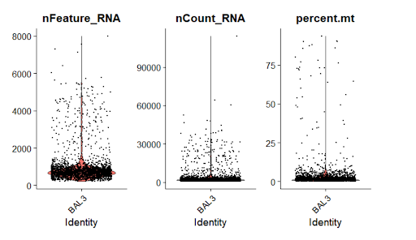
Post-filtering: 
Cells with mitochondrial genes at < 0.05%, and number of unique genes expressed in each cell with counts between 200 and 2500.

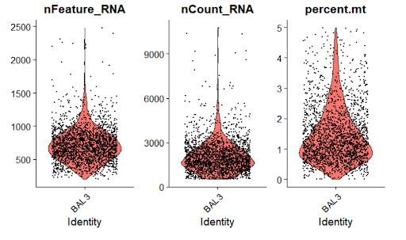

Feature selection:
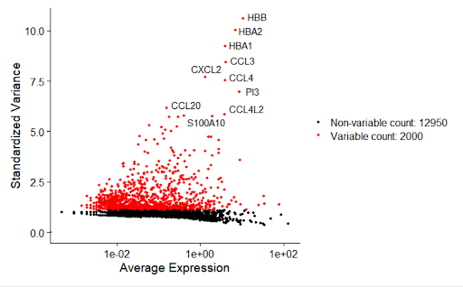

PCA:
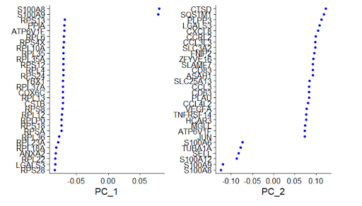

Our aims were somewhat modified to complement the new dataset we used. Similar to the aims in our previous proposal, we still want to identify differentially expressed genes across different conditions and within a certain group/type. However, the conditions and groups/types of interest have changed. 
For example, we previously wanted to identify differentially expressed genes between COVID positive and negative patients, within cell types. And now one of our new aims is interested in identifying differentially expressed genes between male and female patients, within disease severity status (mild, severe). 
We mainly used the R package Seurat to explore, preprocess, and analyze the 10X single cell seq data. 
The markdown files containing our preprocessing and analysis steps so far can be found at: 
- [The metadata file compiling](https://github.com/STAT540-UBC/Repo_team_Quaranteam_2021W2/commit/138929c240c1f7fff478583b4cad6aa3125c53d0)
- [Automated preprocessing](https://github.com/STAT540-UBC/Repo_team_Quaranteam_2021W2/blob/master/Project_Script/preprocessing/automated_preprocessing.Rmd)

## Results (2 pts.)

**What are your primary results?** 
Utilizing UMAP clustering on our combined datasets, we have identified 10 unique cell clusters present amongst male and female BAL samples. Each cell cluster represents a cell type with similar expression profiles. Both sexes share similar cluster profiles, however three clusters in particular appear to be more dominant in males than females: cluster 5, cluster 7, and cluster 9. These three clusters have a higher cell population in male samples and are present in low abundance in females. This indicates a difference in cell population, or expression, that may be relevant to viral infection and immune response. 
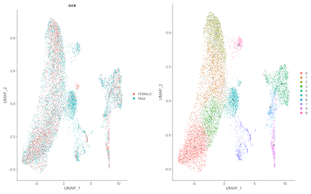
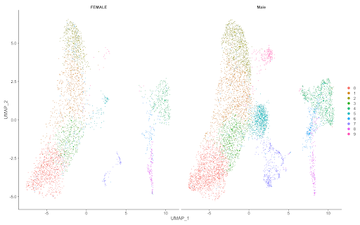 
At the moment however we are still investigating various resources and methodologies to identify the specific cell types these clusters belong to. We have identified genes that are differentially expressed in different clusters, but need to investigate whether these genes are indicative of biological markers. (See the table below for DE genes in cluster 0, as an example).

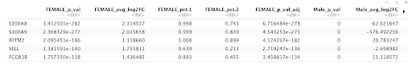

**Were you able to answer your hypothesis? Did you have any positive results? If no, postulate a discussion as to why that may be. Provide plots and/or tables to present your results.** 
As of yet, we still need to explore what genes are differentially expressed between the samples in our dataset, and have not been able to conclusively address whether there is a significant difference in gene expression between females/males that is relevant to immune response (as a part of our project aims); however, we have examined the top 10 differentially expressed genes present within each of our samples (identifying genes that are highly expressed in some cell types, and lowly expressed in others). 

Interestingly, there are some key differences between males and females. For example, CXCL5, a cytokine involved in activation of neutrophils, appears in both male samples as differentially expressed (within the top 10), but is not present in females. IL6, another important cytokine, also appears DE in males but not females. There is reported evidence that IL6 is an indicator of severe Covid symptoms (Ulhaq et al.), although there is some controversy (Chen et al.). This analysis however is still very preliminary, and more work will have to be done to indicate whether these genes are truly differentially expressed when comparing male and female samples. 
**List some challenges that you have encountered or anticipate. How will you address them?** 
One challenge we have faced is that there remains gene outliers in the male samples that have much higher expression values than other genes. This makes it difficult to identify DE genes when comparing female and male samples. Further filtering of our data will likely fix this issue. As we increase our dataset from 4 samples to all 54, we hope this will also provide statistical power in identifying DE genes between different factors, like sex and age. 

## References

1. Ulhaq ZS, Soraya GV. 2020. Interleukin-6 as a Potential Biomarker of COVID-19 Progression. Med. Mal. Infect. 50(4): 382-383
2. Chen LYC, Hoiland RL, Stukas S, Wellington CL, Sekhon MS. 2020. Confronting the Controversy: Interleukin-6 and the COVID-19 Cytokine Storm Syndrome

