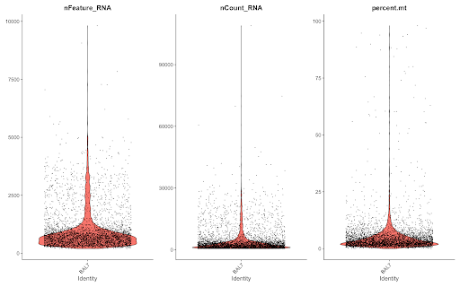
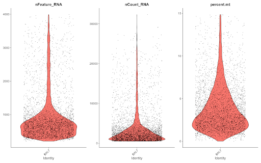
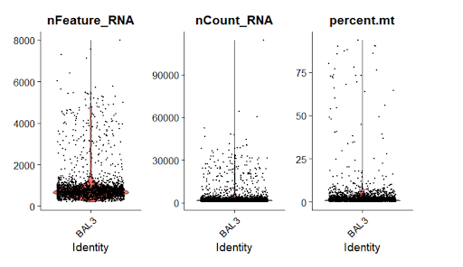
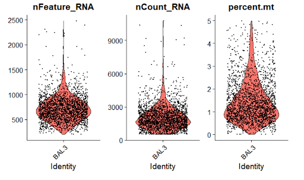
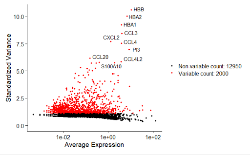
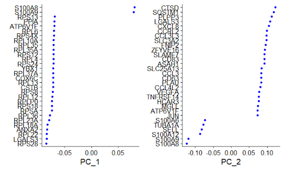
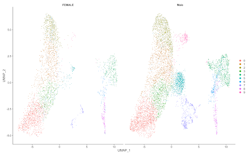

Progress Report
================
Team 8: Quaranteam
19/03/2021

## What has changed based on the final proposal (2 pt.)

**Did your dataset change? If so, why?**

We have switched to a different dataset due to difficulties extracting
the expression data from our original dataset. The original dataset was
in the form of a 61GB (uncompressed) HDF5 file, which contained one
expression matrix that was too large to load into R without extensive
subsetting. Our new dataset is also an scRNA-seq from COVID-19 patients
but is much more manageable and can easily be extracted with getGEO().
Our new dataset is GSE157344, which corresponds to a Nature
Communications paper from March 5 called Deciphering the state of immune
silence in fatal COVID-19 patients. It contains single cell
transcriptomics data from patients with mild or severe COVID-19 disease
as well as from healthy controls. The data is from immune cells isolated
from peripheral blood samples of all cases and controls, as well as
bronchoalveolar lavage fluids from the severe cases. The metadata
contains age, disease outcome, disease severity, comorbidities, sex, and
sample type features. There are 54 samples in total, from 21 severe and
6 mild patients and 5 controls. Each sample has \[LIST DIMS\]; over
150,000 cells are represented in total.

**Have you decided to do a different analysis than what was mentioned in
your proposal? If so, Why?**

Our aims for this project have changed to reflect the features of the
new dataset. The overall goal is to determine how (if at all) the immune
response to SARS-CoV-2 infection differs between male and female
patients and between patients of varying ages, based on differential
expression analysis of single cell data. If significant transcriptomic
differences between the sexes can be seen from the data, this could have
implications for vaccination protocols and treatment procedures. In
order to characterize sex differences in immune response, we have four
aims:

1.  Determine the top differentially expressed genes between male and
    female patients with mild and severe disease.
2.  Determine the top differentially expressed genes in each immune cell
    type cluster between male and female patients and controls.
3.  Determine the top differentially expressed genes in each sample type
    (peripheral blood vs lavage fluid) between male and female patients
    with severe disease.
4.  Determine whether patient age affects differential expression in
    each sample type (peripheral blood vs lavage fluid) between male and
    female patients with severe disease.

**Are there any changes in task assignments of group members?**  The
updated division of work strategy is:

| Name     |           Tasks           |
|----------|:-------------------------:|
| Jackson  |   Aim 1, data cleaning    |
| Yilin    |  Aim 2, data collection   |
| Trevor   | Aim 3, data visualization |
| Madeline |  Aim 4, data validation   |

## What is the progress of the analyses (4 pts.)

We used two male samples (BAL7 and BAL27) and two female samples (BAL6
and BAL3) just to test out the mechanics of our workflow. The full set
of 54 samples will be included in the final analysis. We also
downloaded, compiled, and processed metadata for all samples. Metadata
included COVID severity status, sex, and patient ID for each of the 54
samples.

For Aims 1-3, our goal is to identify the genes that are differentially
expressed across different conditions. In order to do this, we first
load each sample dataset and create a Seurat object for each one. Then,
each Seurat object goes through a standard pre-processing workflow,
including quality control filtering and normalization. We filtered cells
with unique feature/gene counts that were less than 200 or greater than
2,500, and filtered cells with greater than 5% mitochondrial counts.
Next, we normalized the sample data using a “LogNormalize” method, which
normalizes expression measurements by total expression, multiplies the
normalized values by a scale factor, and then log-transforms the result
of that. Because we have 54 samples that all need the same
preprocessing, we created an automated script that will filter and
normalize each sample the same way.

Example preprocessing plots for two samples are below:

**BAL7 (Male, Severe COVID, lung lavage):**  Prefiltering. Violin
plots of nFeature, nCount, and percentage of mitochondrial gene
transcripts from each cell:

 

After applying the filter: plots for all cells with less than 15%
mitochondrial genes, and all unique genes expressed between 200 and 4000
counts.

Feature selection: the figure on the right labels the top 10 genes that
are highly variable across different cells in the BAL7 sample:

**BAL3 (Female, Severe COVID, lung lavage):**

Pre-filtering, same plots as for BAL7:

 Post-filtering:

Cells with mitochondrial genes at &lt; 0.05%, and number of unique genes
expressed in each cell with counts between 200 and 2500.

Feature selection:

PCA:

Our aims were somewhat modified to complement the new dataset we used.
Similar to the aims in our previous proposal, we still want to identify
differentially expressed genes across different conditions and within a
certain group/type. However, the conditions and groups/types of interest
have changed.  For example, we previously wanted to identify
differentially expressed genes between COVID positive and negative
patients, within cell types. And now one of our new aims is interested
in identifying differentially expressed genes between male and female
patients, within disease severity status (mild, severe).  We mainly
used the R package Seurat to explore, preprocess, and analyze the 10X
single cell seq data.  The markdown files containing our
preprocessing and analysis steps so far can be found at:

-   [The metadata file
    compiling](https://github.com/STAT540-UBC/Repo_team_Quaranteam_2021W2/commit/138929c240c1f7fff478583b4cad6aa3125c53d0)
-   [Automated
    preprocessing](https://github.com/STAT540-UBC/Repo_team_Quaranteam_2021W2/blob/master/Project_Script/preprocessing/automated_preprocessing.Rmd)

## Results (2 pts.)

**What are your primary results?**  Utilizing UMAP clustering on our
combined datasets, we have identified 10 unique cell clusters present
amongst male and female BAL samples. Each cell cluster represents a cell
type with similar expression profiles. Both sexes share similar cluster
profiles, however three clusters in particular appear to be more
dominant in males than females: cluster 5, cluster 7, and cluster 9.
These three clusters have a higher cell population in male samples and
are present in low abundance in females. This indicates a difference in
cell population, or expression, that may be relevant to viral infection
and immune response.    At the moment
however we are still investigating various resources and methodologies
to identify the specific cell types these clusters belong to. We have
identified genes that are differentially expressed in different
clusters, but need to investigate whether these genes are indicative of
biological markers. (See the table below for DE genes in cluster 0, as
an example).

**Were you able to answer your hypothesis? Did you have any positive
results? If no, postulate a discussion as to why that may be. Provide
plots and/or tables to present your results.**  As of yet, we still
need to explore what genes are differentially expressed between the
samples in our dataset, and have not been able to conclusively address
whether there is a significant difference in gene expression between
females/males that is relevant to immune response (as a part of our
project aims); however, we have examined the top 10 differentially
expressed genes present within each of our samples (identifying genes
that are highly expressed in some cell types, and lowly expressed in
others). 

Interestingly, there are some key differences between males and females.
For example, CXCL5, a cytokine involved in activation of neutrophils,
appears in both male samples as differentially expressed (within the top
10), but is not present in females. IL6, another important cytokine,
also appears DE in males but not females. There is reported evidence
that IL6 is an indicator of severe Covid symptoms (Ulhaq et al.),
although there is some controversy (Chen et al.). This analysis however
is still very preliminary, and more work will have to be done to
indicate whether these genes are truly differentially expressed when
comparing male and female samples.

**List some challenges that you have encountered or anticipate. How will
you address them?**  One challenge we have faced is that there
remains gene outliers in the male samples that have much higher
expression values than other genes. This makes it difficult to identify
DE genes when comparing female and male samples. Further filtering of
our data will likely fix this issue. As we increase our dataset from 4
samples to all 54, we hope this will also provide statistical power in
identifying DE genes between different factors, like sex and age.

## References

1.  Ulhaq ZS, Soraya GV. 2020. Interleukin-6 as a Potential Biomarker of
    COVID-19 Progression. Med. Mal. Infect. 50(4): 382-383
2.  Chen LYC, Hoiland RL, Stukas S, Wellington CL, Sekhon MS. 2020.
    Confronting the Controversy: Interleukin-6 and the COVID-19 Cytokine
    Storm Syndrome
