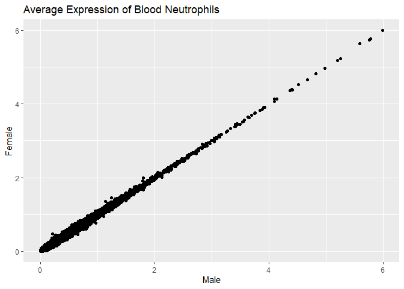
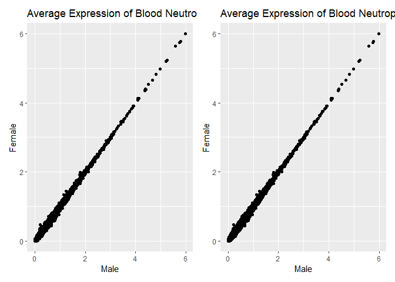
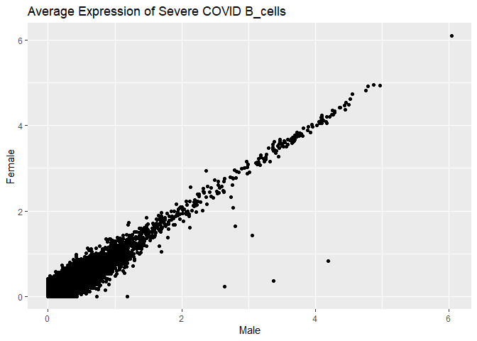
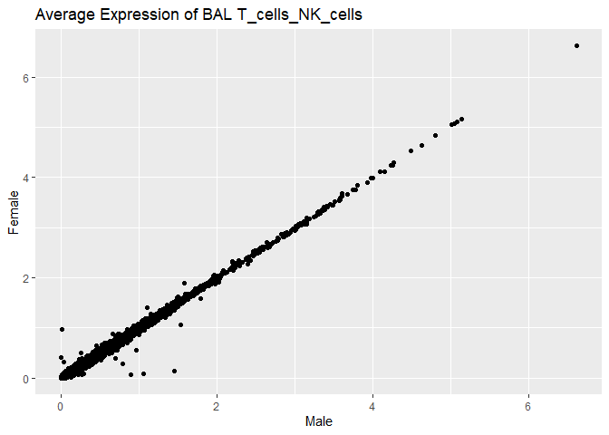
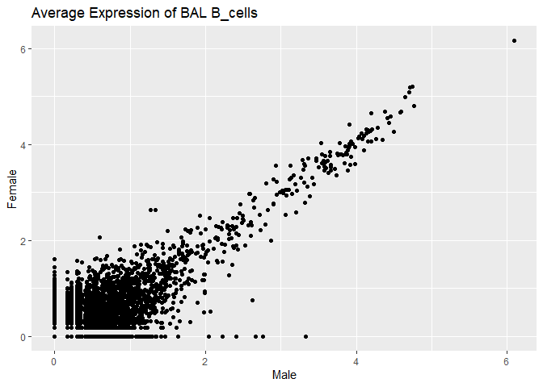
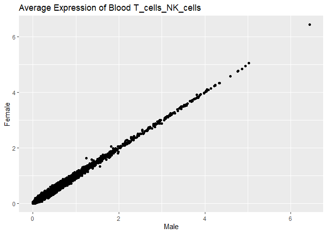

Differential\_Expression\_Analysis
================
Trevor Kwan
08/04/2021

## Load the Preprocessed and Merged Dataset

``` r
# load the dataset (it has already been merged)
# change the file path to wherever you have saved it on your computer
dt <- readRDS("../../raw_data/All_Samples_Merged_Filtered")

# neut = 0, 1, 4, 5, 9, 10, 11
# mono = 2, 8
# macro = 3, 7
# T cells = 6
# epithelial = 12
# B cells = 13

cluster_ID_list <- list(Neutrophils = c("0", "1", "4", "5", "9", "10", "11"),
                        Monocytes = c("2", "8"), 
                        Macrophages = c("3", "7"), 
                        T_cells_NK_cells = "6", 
                        Epithelial_cells = "12", 
                        B_cells = "13")
```

## Aim 3 Objective

Identify differentially expressed genes between male and female patients
across COVID severity type (severe vs. mild. healthy) and within cell
types.

## Aim 4 Objective

Identify differentially expressed genes between male and female patients
across tissue type (lavage fliud vs. blood) and within cell types.

## Creating Average Expression Level Plots

`get_exp_plot` takes a specified COVID severity (Aim 3) or tissue type
(Aim 4) and a cell type of interest, and plots the average expression
comparing male and female.

For example, get\_exp\_plot(COVID\_severity = NA, tissue\_type =
“Blood”, cell\_type = “Neutrophils”) returns a scatterplot showing
the average gene expression levels comparing male and female for genes
of blood tissue and genes in Neutrophils. Each plot point represents a
gene and it’s corresponding expression level for male and female.

## Identifying Differentially Expressed Genes Across Conditions

`get_DE_genes` takes a specified COVID severity (Aim 3) or tissue type
(Aim 4) and a cell type of interest, and identifies the top
differentially expressed genes across male and female (up to a maximum
of 15 genes). These are the genes that change in different sex
conditions for a given cell type and COVID severity, or a given cell
type and tissue type.

For example, get\_DE\_genes(COVID\_severity = “Severe COVID”,
tissue\_type = NA, cell\_type = “B\_cells”) returns the top
differentially expressed genes across male and female for genes labeled
as “Severe COVID” and genes in B cells.

#### Statistical Methodology/Approach

The FindMarkers() function is used from the Seurat package in this
differential expression analysis. By default, FindMarkers() uses
Wilcoxon Rank Sum tests to identify differentially expressed genes
between two groups of cells. More specifically, a Wilcoxon Rank Sum test
compares the expression values across male and female for each gene, for
specified conditions.

For example, suppose we are interested in gene expression of the B cells
of “Severe COVID” patients comparing male and females. The Wilcoxon Rank
Sum test takes the sum of the ranks of expression levels of B cells of
“Severe COVID” male patients and compares that with the sum of the
ranks of expression levels of B cells of “Severe COVID” female patients
to see if the two samples are significantly different.

The Wilcoxon Rank Sum test has three assumptions: - the two samples are
independent of one another - the two populations have equal variance or
spread - the two populations are normally distributed

We chose to use the Wilcoxon Rank Sum test over the t-test because the
data we are analyzing may potentially have many outliers.

## Function Parameters for `get_DE_genes` and `get_exp_plot`

  - COVID\_severity: “Severe COVID”, “Mild COVID”, “Healthy control”, NA
  - tissue\_type: “BAL”, “Blood”, NA
  - cell\_type: “Neutrophils”, “Monocytes”, “Macrophages”,
    “T\_cells\_NK\_cells”, “Epithelial\_cells”, “B\_cells”

## `get_DE_genes` Function

``` r
# create function to identify top DE genes 
get_DE_genes <- function(COVID_severity, tissue_type, cell_type){
  
  if (is.na(COVID_severity) == FALSE) {
  # subset by clinic status
  dt.sub <- subset(dt, clinic_status == COVID_severity)
  }
  
  if (is.na(tissue_type) == FALSE) {
  # subset by tissue type
  dt.sub <- subset(dt, tissue == tissue_type)
  }

  # subset by cell type
  if (cell_type == "Neutrophils") {
    cell_ID <- 1
  }
  if (cell_type == "Monocytes") {
    cell_ID <- 2
  }
  if (cell_type == "Macrophages") {
    cell_ID <- 3
  }
  if (cell_type == "T_cells_NK_cells") {
    cell_ID <- 4
  }
  if (cell_type == "Epithelial_cells") {
    cell_ID <- 5
  }
  if (cell_type == "B_cells") {
    cell_ID <- 6
  }
  dt.sub <- subset(dt.sub, seurat_clusters == cluster_ID_list[[cell_ID]])

  # create df
  Idents(dt.sub) <- c("male", "female")
  avg.dt.sub <- as.data.frame(log1p(AverageExpression(dt.sub, verbose = FALSE)$RNA))
  avg.dt.sub$gene <- rownames(avg.dt.sub)

  # find DE genes
  dt.response <- FindMarkers(dt.sub, ident.1 = "male", ident.2 = "female", verbose = FALSE)
  dt.response <- head(dt.response, n = 15)
  return(dt.response)
}
```

``` r
# Example of get_DE_genes
get_DE_genes(COVID_severity = "Severe COVID", tissue_type = NA, cell_type = "B_cells")
```

    ##                p_val avg_log2FC pct.1 pct.2 p_val_adj
    ## RLIM    0.0003237115  0.6233978 0.200 0.000         1
    ## SLC25A5 0.0013358515 -0.6913124 0.333 0.644         1
    ## GTF2H5  0.0017815939 -0.5469001 0.000 0.153         1
    ## GBP4    0.0021245587  0.6011261 0.150 0.000         1
    ## CHMP4B  0.0021764795  0.5230262 0.250 0.051         1
    ## MPRIP   0.0023689293  0.5419930 0.283 0.068         1
    ## HARS    0.0033635147 -0.4115142 0.000 0.136         1
    ## TTC7A   0.0037524275 -0.5357617 0.017 0.169         1
    ## SNRPC   0.0038195849 -0.7454215 0.083 0.288         1
    ## RBMX2   0.0038809497 -0.4987613 0.017 0.169         1
    ## CREB1   0.0039161293 -0.7399932 0.083 0.288         1
    ## TMEM222 0.0039337477  0.5311838 0.133 0.000         1
    ## DHRSX   0.0039337477  0.4920126 0.133 0.000         1
    ## CCSER2  0.0039337477  0.5009274 0.133 0.000         1
    ## ABCD4   0.0039337477  0.4614501 0.133 0.000         1

``` r
# testing the get_DE_genes function
dt.sub <- subset(dt, clinic_status == "Severe COVID")
# 67468 left after subset
dt.sub <- subset(dt.sub, seurat_clusters == cluster_ID_list[[6]])
# 119 left after subset
Idents(dt.sub) <- c("male", "female")
avg.dt.sub <- as.data.frame(log1p(AverageExpression(dt.sub, verbose = FALSE)$RNA))
avg.dt.sub$gene <- rownames(avg.dt.sub)
dt.response <- FindMarkers(dt.sub, ident.1 = "male", ident.2 = "female", verbose = FALSE)
dt.response <- head(dt.response, n = 15)

# should equal TRUE if function works
all.equal(dt.response, get_DE_genes(COVID_severity = "Severe COVID", tissue_type = NA, cell_type = "B_cells"))
```

    ## [1] TRUE

## `get_exp_plot` Function

``` r
# create function to create expression plots
get_exp_plot <- function(COVID_severity, tissue_type, cell_type){
  
  if (is.na(COVID_severity) == FALSE) {
  # subset by clinic status
  dt.sub <- subset(dt, clinic_status == COVID_severity)
  }
  
  if (is.na(tissue_type) == FALSE) {
  # subset by tissue type
  dt.sub <- subset(dt, tissue == tissue_type)
  }
  
  # subset by cell type
  if (cell_type == "Neutrophils") {
    cell_ID <- 1
  }
  if (cell_type == "Monocytes") {
    cell_ID <- 2
  }
  if (cell_type == "Macrophages") {
    cell_ID <- 3
  }
  if (cell_type == "T_cells_NK_cells") {
    cell_ID <- 4
  }
  if (cell_type == "Epithelial_cells") {
    cell_ID <- 5
  }
  if (cell_type == "B_cells") {
    cell_ID <- 6
  }
  dt.sub <- subset(dt.sub, seurat_clusters == cluster_ID_list[[cell_ID]])

  # create df
  Idents(dt.sub) <- c("male", "female")
  avg.dt.sub <- as.data.frame(log1p(AverageExpression(dt.sub, verbose = FALSE)$RNA))
  avg.dt.sub$gene <- rownames(avg.dt.sub)

  # create plot
  if (is.na(COVID_severity) == FALSE) {
  p <- ggplot(avg.dt.sub, aes(male, female)) + geom_point() + 
    ggtitle(paste("Average Expression of", COVID_severity, cell_type)) +
    labs(x = "Male", y = "Female")
  }
  
  if (is.na(tissue_type) == FALSE) {
  p <- ggplot(avg.dt.sub, aes(male, female)) + geom_point() + 
    ggtitle(paste("Average Expression of", tissue_type, cell_type)) +
    labs(x = "Male", y = "Female")
  }

  # find DE genes
  dt.response <- FindMarkers(dt.sub, ident.1 = "male", ident.2 = "female", verbose = FALSE)
  dt.response <- head(dt.response, n = 15)
  
  return(p)
}
```

``` r
# Example of get_plot
get_exp_plot(COVID_severity = NA, tissue_type = "Blood", cell_type = "Neutrophils")
```

    ## Warning in FindMarkers.default(object = data.use, slot = data.slot, counts =
    ## counts, : No features pass logfc.threshold threshold; returning empty data.frame

<!-- -->

``` r
# testing the get_plot function
dt.sub_plot <- subset(dt, tissue == "Blood")
# 47334 left after subset
dt.sub_plot <- subset(dt.sub_plot, seurat_clusters == cluster_ID_list[[1]])
# 4289 left after subset
Idents(dt.sub_plot) <- c("male", "female")
avg.dt.sub_plot <- as.data.frame(log1p(AverageExpression(dt.sub_plot, verbose = FALSE)$RNA))
avg.dt.sub_plot$gene <- rownames(avg.dt.sub_plot)
p <- ggplot(avg.dt.sub_plot, aes(male, female)) + geom_point() + 
    ggtitle(paste("Average Expression of Blood Neutrophils")) +
    labs(x = "Male", y = "Female")

# check to see if both plots are equal
get_exp_plot(COVID_severity = NA, tissue_type = "Blood", cell_type = "Neutrophils") + p
```

    ## Warning in FindMarkers.default(object = data.use, slot = data.slot, counts =
    ## counts, : No features pass logfc.threshold threshold; returning empty data.frame

<!-- -->

## Aim 3 DE genes

Identify top male and female DE genes for T\_cells\_NK\_cells and
B\_cells across COVID severity.

``` r
get_DE_genes(COVID_severity = "Severe COVID", tissue_type = NA, cell_type = "T_cells_NK_cells")
```

    ##             p_val avg_log2FC pct.1 pct.2 p_val_adj
    ## XCL2   0.07326542 -0.2678863 0.099 0.120         1
    ## HSPA1A 0.10776260  0.6376632 0.156 0.178         1
    ## PLCG2  0.27900111  0.3068325 0.225 0.208         1
    ## S100A8 0.38752105 -0.3026388 0.106 0.097         1
    ## CCL4L2 0.60627892 -0.4404375 0.125 0.131         1
    ## CXCL8  0.87181007  0.2514535 0.271 0.276         1

``` r
get_DE_genes(COVID_severity = "Severe COVID", tissue_type = NA, cell_type = "B_cells")
```

    ##                p_val avg_log2FC pct.1 pct.2 p_val_adj
    ## RLIM    0.0003237115  0.6233978 0.200 0.000         1
    ## SLC25A5 0.0013358515 -0.6913124 0.333 0.644         1
    ## GTF2H5  0.0017815939 -0.5469001 0.000 0.153         1
    ## GBP4    0.0021245587  0.6011261 0.150 0.000         1
    ## CHMP4B  0.0021764795  0.5230262 0.250 0.051         1
    ## MPRIP   0.0023689293  0.5419930 0.283 0.068         1
    ## HARS    0.0033635147 -0.4115142 0.000 0.136         1
    ## TTC7A   0.0037524275 -0.5357617 0.017 0.169         1
    ## SNRPC   0.0038195849 -0.7454215 0.083 0.288         1
    ## RBMX2   0.0038809497 -0.4987613 0.017 0.169         1
    ## CREB1   0.0039161293 -0.7399932 0.083 0.288         1
    ## TMEM222 0.0039337477  0.5311838 0.133 0.000         1
    ## DHRSX   0.0039337477  0.4920126 0.133 0.000         1
    ## CCSER2  0.0039337477  0.5009274 0.133 0.000         1
    ## ABCD4   0.0039337477  0.4614501 0.133 0.000         1

``` r
get_DE_genes(COVID_severity = "Mild COVID", tissue_type = NA, cell_type = "T_cells_NK_cells")
```

    ##                 p_val avg_log2FC pct.1 pct.2 p_val_adj
    ## PRDX2    0.0007831340  0.3099341 0.158 0.092         1
    ## SECISBP2 0.0009473272  0.3708796 0.128 0.069         1
    ## BTG1     0.0009494570 -0.2599985 0.678 0.741         1
    ## C9orf78  0.0021917360  0.4762247 0.303 0.229         1
    ## MYL6     0.0025021442  0.3365664 0.593 0.514         1
    ## C1orf56  0.0028176204 -0.4316946 0.166 0.234         1
    ## ANAPC16  0.0033879804  0.2738744 0.232 0.161         1
    ## TBCB     0.0036591108 -0.3733270 0.080 0.132         1
    ## FAM32A   0.0042556857 -0.3811977 0.057 0.102         1
    ## FGFR1OP2 0.0043827811 -0.3789195 0.076 0.127         1
    ## DDX46    0.0063952695 -0.4619451 0.102 0.153         1
    ## HDAC1    0.0068367007 -0.2604541 0.059 0.102         1
    ## RAC1     0.0071199417  0.4177470 0.258 0.196         1
    ## EIF3G    0.0078445174  0.2533530 0.291 0.220         1
    ## LYZ      0.0083704414 -0.4247666 0.192 0.259         1

``` r
get_DE_genes(COVID_severity = "Mild COVID", tissue_type = NA, cell_type = "B_cells")
```

    ##                p_val avg_log2FC pct.1 pct.2 p_val_adj
    ## DNAJC21 3.405102e-05  0.9330482 0.477 0.070  0.670805
    ## TMED5   9.244106e-04 -0.9471448 0.023 0.279  1.000000
    ## ALG5    1.512698e-03 -0.6946345 0.000 0.209  1.000000
    ## EMP3    1.572057e-03 -0.9141623 0.409 0.721  1.000000
    ## SIK3    1.815888e-03  0.9308566 0.386 0.116  1.000000
    ## DHX29   1.880373e-03  1.0671006 0.250 0.023  1.000000
    ## RHBDF2  2.597366e-03 -0.5720724 0.045 0.302  1.000000
    ## RICTOR  2.667464e-03  1.2391335 0.455 0.186  1.000000
    ## TCF3    2.907652e-03  0.8977589 0.364 0.093  1.000000
    ## QKI     3.080770e-03  0.9121023 0.341 0.093  1.000000
    ## HADHB   3.275782e-03 -0.6162658 0.023 0.233  1.000000
    ## RRAGB   3.679157e-03  0.5330679 0.182 0.000  1.000000
    ## MARCH1  4.872662e-03  0.9230826 0.545 0.302  1.000000
    ## IRF3    5.579617e-03  0.6718537 0.227 0.023  1.000000
    ## FAM200B 5.732467e-03 -0.5181588 0.000 0.163  1.000000

``` r
get_DE_genes(COVID_severity = "Healthy control", tissue_type = NA, cell_type = "T_cells_NK_cells")
```

    ##               p_val avg_log2FC pct.1 pct.2 p_val_adj
    ## FAM78A  0.002758873 -0.2558314 0.077 0.130         1
    ## TLK2    0.031744841  0.2601118 0.160 0.117         1
    ## CCL4    0.090295920 -0.2951792 0.477 0.536         1
    ## OTULIN  0.099212386 -0.2979508 0.189 0.224         1
    ## FOSL2   0.151086177 -0.2541826 0.326 0.356         1
    ## PTGDS   0.159161024 -0.4583331 0.107 0.133         1
    ## CCDC88C 0.286281267 -0.2781645 0.397 0.413         1
    ## CXCL8   0.304992585 -0.3981069 0.121 0.144         1
    ## FBXW5   0.346441568 -0.2989194 0.254 0.270         1
    ## GZMK    0.474925317 -0.2662136 0.181 0.192         1
    ## S100A8  0.527429238  0.6203211 0.126 0.114         1
    ## TNF     0.611016537 -0.2976325 0.217 0.199         1
    ## HBA1    0.723896312  0.2579140 0.151 0.158         1
    ## S100A9  0.789955499  0.5239439 0.144 0.151         1

``` r
get_DE_genes(COVID_severity = "Healthy control", tissue_type = NA, cell_type = "B_cells")
```

    ##                p_val avg_log2FC pct.1 pct.2 p_val_adj
    ## SHC1    0.0003113618 -0.3143295 0.025 0.130         1
    ## DFFA    0.0004455782  0.3086889 0.105 0.012         1
    ## HSPB1   0.0005888497  0.7690106 0.204 0.074         1
    ## UBE2W   0.0006487893 -0.3169690 0.025 0.123         1
    ## THRA    0.0011821624 -0.2784393 0.019 0.105         1
    ## TMEM123 0.0017676534 -0.3955096 0.605 0.741         1
    ## SPTAN1  0.0018814081 -0.4049537 0.117 0.247         1
    ## BLOC1S4 0.0020363836 -0.2748959 0.160 0.309         1
    ## ZFP36L1 0.0023086794 -0.3404585 0.494 0.636         1
    ## DRAP1   0.0023461200  0.3898420 0.451 0.290         1
    ## TRIM8   0.0026965643 -0.2537495 0.049 0.148         1
    ## UBE4A   0.0028334361  0.3448179 0.241 0.117         1
    ## PRKCSH  0.0030025966 -0.2853727 0.142 0.284         1
    ## CTSD    0.0031434478  0.2735616 0.167 0.062         1
    ## MXD1    0.0042663086 -0.3289443 0.062 0.160         1

## Aim 4 DE genes

Identify top male and female DE genes for T\_cells\_NK\_cells and
B\_cells across tissue type.

``` r
get_DE_genes(COVID_severity = NA, tissue_type = "BAL", cell_type = "T_cells_NK_cells")
```

    ##             p_val avg_log2FC pct.1 pct.2 p_val_adj
    ## XCL2   0.09492618 -0.3073118 0.098 0.118         1
    ## HSPA1A 0.10467073  0.6628469 0.165 0.189         1
    ## CCL4L2 0.72106753 -0.4454339 0.130 0.135         1
    ## CXCL8  0.88115072  0.2963193 0.284 0.290         1

``` r
get_DE_genes(COVID_severity = NA, tissue_type = "BAL", cell_type = "B_cells")
```

    ##             p_val avg_log2FC pct.1 pct.2 p_val_adj
    ## IDS    0.01204181  1.8122268 0.667 0.111         1
    ## POLD2  0.01395012 -2.0818360 0.000 0.556         1
    ## NUP98  0.01395012 -1.6379338 0.000 0.556         1
    ## ETS1   0.01395012 -1.5964805 0.000 0.556         1
    ## GPR183 0.01395012 -2.3181879 0.000 0.556         1
    ## ARPP19 0.01395012  1.4170432 0.556 0.000         1
    ## FCRL2  0.01395012  1.9451903 0.556 0.000         1
    ## MT-ND4 0.01511703 -0.7393468 0.889 0.889         1
    ## NDUFA4 0.01715132  1.3138166 0.889 0.444         1
    ## STK17A 0.01835339 -1.5427822 0.222 0.778         1
    ## ARF5   0.02088575  1.2626875 0.667 0.111         1
    ## CHD2   0.02088575 -1.4372522 0.111 0.667         1
    ## GRB2   0.02088575 -1.5418082 0.111 0.667         1
    ## TLN1   0.02272054  1.6919129 0.667 0.222         1
    ## HNRNPD 0.03002674 -1.0985653 0.222 0.778         1

``` r
get_DE_genes(COVID_severity = NA, tissue_type = "Blood", cell_type = "T_cells_NK_cells")
```

    ##              p_val avg_log2FC pct.1 pct.2 p_val_adj
    ## PTGDS  0.003399829 -0.5474796 0.110 0.148         1
    ## PLCG2  0.008270798 -0.3034187 0.211 0.169         1
    ## NUP210 0.014403389 -0.2795832 0.136 0.168         1
    ## CCL4   0.046129635 -0.3190844 0.337 0.374         1
    ## LYZ    0.050000962  0.3397268 0.160 0.134         1
    ## GZMK   0.152683304 -0.2546166 0.114 0.130         1

``` r
get_DE_genes(COVID_severity = NA, tissue_type = "Blood", cell_type = "B_cells")
```

    ##                p_val avg_log2FC pct.1 pct.2 p_val_adj
    ## CEP57   0.0002512441 -0.4095586 0.105 0.227         1
    ## GSPT1   0.0011950166  0.3124394 0.215 0.109         1
    ## HEXDC   0.0012531821 -0.2774245 0.094 0.195         1
    ## KLF6    0.0023649292  0.4515659 0.730 0.664         1
    ## TGIF2   0.0027639563 -0.3381344 0.078 0.164         1
    ## KANSL1  0.0033806592  0.3165460 0.305 0.195         1
    ## TAP1    0.0037661920  0.2674972 0.184 0.098         1
    ## ATP5C1  0.0048342499 -0.2753629 0.152 0.254         1
    ## RNF38   0.0049046539 -0.2689811 0.066 0.141         1
    ## TMEM219 0.0049749455  0.2644433 0.359 0.254         1
    ## NDUFB10 0.0050164623 -0.3343621 0.215 0.320         1
    ## GID8    0.0055587524 -0.2515357 0.137 0.227         1
    ## EMP3    0.0056776052  0.4592713 0.590 0.496         1
    ## LMF2    0.0061841713  0.2541372 0.109 0.047         1
    ## LYRM1   0.0078866659 -0.2507297 0.059 0.125         1

## Aim 3 Plots

Create expression plots comparing male and female average expression
levels for every combination of COVID\_severity and two cell types
(T\_cells\_NK\_cells or B\_cells).

``` r
get_exp_plot(COVID_severity = "Severe COVID", tissue_type = NA, cell_type = "T_cells_NK_cells")
```

<!-- -->

``` r
get_exp_plot(COVID_severity = "Severe COVID", tissue_type = NA, cell_type = "B_cells")
```

<!-- -->

``` r
get_exp_plot(COVID_severity = "Mild COVID", tissue_type = NA, cell_type = "T_cells_NK_cells")
```

<!-- -->

``` r
get_exp_plot(COVID_severity = "Mild COVID", tissue_type = NA, cell_type = "B_cells")
```

<!-- -->

``` r
get_exp_plot(COVID_severity = "Healthy control", tissue_type = NA, cell_type = "T_cells_NK_cells")
```

<!-- -->

``` r
get_exp_plot(COVID_severity = "Healthy control", tissue_type = NA, cell_type = "B_cells")
```

<!-- -->

## Aim 4 Plots

Create expression plots comparing male and female average expression
levels for every combination of tissue type and two cell types
(T\_cells\_NK\_cells or B\_cells).

``` r
get_exp_plot(COVID_severity = NA, tissue_type = "BAL", cell_type = "T_cells_NK_cells")
```

<!-- -->

``` r
get_exp_plot(COVID_severity = NA, tissue_type = "BAL", cell_type = "B_cells")
```

<!-- -->

``` r
get_exp_plot(COVID_severity = NA, tissue_type = "Blood", cell_type = "T_cells_NK_cells")
```

<!-- -->

``` r
get_exp_plot(COVID_severity = NA, tissue_type = "Blood", cell_type = "B_cells")
```

<!-- -->

## Identify DE genes for GO enrichment: Neutrophils

``` r
get_DE_genes(COVID_severity = "Severe COVID", tissue_type = NA, cell_type = "Neutrophils")
```

    ## Warning in `==.default`(seurat_clusters, cluster_ID_list[[cell_ID]]): longer
    ## object length is not a multiple of shorter object length

    ## Warning in is.na(e1) | is.na(e2): longer object length is not a multiple of
    ## shorter object length

    ##               p_val avg_log2FC pct.1 pct.2 p_val_adj
    ## MT2A     0.02359572  0.5302435 0.107 0.090         1
    ## SERPINB9 0.02961437 -0.2558125 0.089 0.104         1
    ## HBB      0.11423782  0.8645935 0.201 0.219         1
    ## HBA2     0.22441599  0.3979185 0.106 0.116         1

``` r
neut_mild_df <- get_DE_genes(COVID_severity = "Mild COVID", tissue_type = NA, cell_type = "Neutrophils")
```

    ## Warning in `==.default`(seurat_clusters, cluster_ID_list[[cell_ID]]): longer
    ## object length is not a multiple of shorter object length

    ## Warning in is.na(e1) | is.na(e2): longer object length is not a multiple of
    ## shorter object length

``` r
# get all significant DE genes for Mild COVID and neutrophils
# neut_mild_df %>% 
#   rownames() %>% 
#   as.vector()

neut_mild_df
```

    ##               p_val avg_log2FC pct.1 pct.2 p_val_adj
    ## TLR4   0.0005003369 -0.6658023 0.102 0.198         1
    ## PPM1F  0.0014030599 -0.5627361 0.096 0.180         1
    ## PPP1CA 0.0015894704  0.5949803 0.171 0.090         1
    ## ERV3-1 0.0028915142 -0.5836980 0.066 0.135         1
    ## PRDX5  0.0039864151  0.3559666 0.267 0.171         1
    ## TLE4   0.0046451474 -0.4433869 0.087 0.159         1
    ## STK4   0.0057567243 -0.4436662 0.375 0.465         1
    ## RPS15  0.0062097078  0.3451678 0.189 0.111         1
    ## PPP3CA 0.0066416166 -0.3754000 0.093 0.165         1
    ## EIF1AY 0.0090601416  0.6253398 0.147 0.084         1
    ## VAMP2  0.0094354115 -0.4656989 0.288 0.375         1
    ## AP3S1  0.0102076132 -0.4819511 0.087 0.150         1
    ## FBXW7  0.0112577414 -0.4149793 0.111 0.180         1
    ## MYO9B  0.0119611208  0.3518896 0.219 0.141         1
    ## TNIP1  0.0142026510 -0.3509604 0.135 0.204         1

``` r
neut_healthy_df <- get_DE_genes(COVID_severity = "Healthy control", tissue_type = NA, cell_type = "Neutrophils")
```

    ## Warning in `==.default`(seurat_clusters, cluster_ID_list[[cell_ID]]): longer
    ## object length is not a multiple of shorter object length

    ## Warning in is.na(e1) | is.na(e2): longer object length is not a multiple of
    ## shorter object length

``` r
# get all significant DE genes for healthy control and neutrophils
# neut_healthy_df %>% 
#   rownames() %>% 
#   as.vector()

neut_healthy_df
```

    ##                 p_val avg_log2FC pct.1 pct.2 p_val_adj
    ## CYTIP    0.0002530143 -0.4967614 0.243 0.349         1
    ## NQO2     0.0011748752  0.5682489 0.110 0.053         1
    ## DDIT3    0.0015019217 -0.3370850 0.139 0.222         1
    ## PELI2    0.0032691982  0.5225801 0.129 0.072         1
    ## C10orf54 0.0036485097 -0.2670204 0.487 0.588         1
    ## PHIP     0.0036636023 -0.3775757 0.135 0.207         1
    ## GGA1     0.0043053089 -0.4460086 0.061 0.114         1
    ## IQSEC1   0.0047316254 -0.4554058 0.152 0.220         1
    ## PYCARD   0.0047971163 -0.3391046 0.148 0.220         1
    ## SH3BGRL3 0.0057518139  0.2680015 0.814 0.763         1
    ## PDLIM7   0.0059916428 -0.3372865 0.167 0.237         1
    ## PRDX5    0.0063442181  0.4128254 0.217 0.152         1
    ## HSPA6    0.0065851011 -0.2861635 0.169 0.243         1
    ## KDM7A    0.0068999811 -0.4345468 0.070 0.121         1
    ## FBXW7    0.0073331269 -0.4516422 0.093 0.150         1

``` r
get_DE_genes(COVID_severity = NA, tissue_type = "BAL", cell_type = "Neutrophils")
```

    ## Warning in `==.default`(seurat_clusters, cluster_ID_list[[cell_ID]]): longer
    ## object length is not a multiple of shorter object length

    ## Warning in is.na(e1) | is.na(e2): longer object length is not a multiple of
    ## shorter object length

    ##                 p_val avg_log2FC pct.1 pct.2 p_val_adj
    ## IFNGR2   0.0004144043  0.2702332 0.289 0.239         1
    ## INSIG1   0.0072533704 -0.2928060 0.141 0.173         1
    ## SERPINB9 0.0086938837 -0.3849594 0.135 0.165         1
    ## HBB      0.3872940541  0.6098652 0.117 0.125         1

``` r
get_DE_genes(COVID_severity = NA, tissue_type = "Blood", cell_type = "Neutrophils")
```

    ## Warning in FindMarkers.default(object = data.use, slot = data.slot, counts =
    ## counts, : No features pass logfc.threshold threshold; returning empty data.frame

    ## [1] avg_log2FC pct.1      pct.2     
    ## <0 rows> (or 0-length row.names)

## Conclusions

Depending on the combination of COVID\_severity, tissue\_type, and
cell\_type, some combinations had over 15 significantly differentially
expressed genes between male and female, but our analysis lists only the
top 15 differentially expressed genes for each combination of
conditions. Points in expression plots that deviate linearly from the
rest of the points suggest the presence of differentially expressed
genes.
