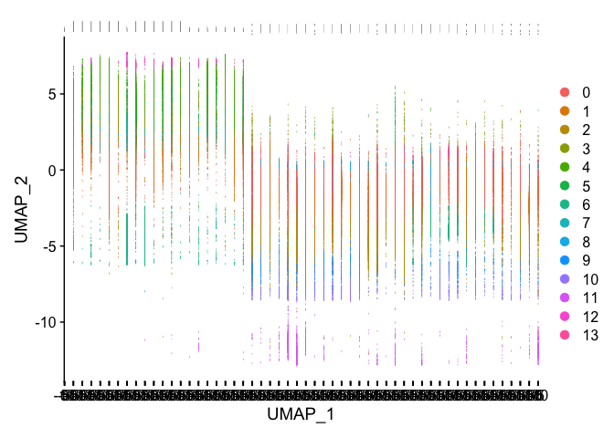

Analyzing and Filtering scRNA Data
================
Jackson Moore
06/04/2021

The following tutorials were used as references to generate this script:
- <https://github.com/hbctraining/scRNA-seq> -
<https://satijalab.org/seurat/articles/pbmc3k_tutorial.html> -
<https://satijalab.org/seurat/articles/integration_introduction.html>

Data was produced by: <https://doi.org/10.1038/s41467-021-21702-6>

scRNA data was downloaded from the supplementary data of:
<https://www.ncbi.nlm.nih.gov/geo/query/acc.cgi?acc=GSE157344>

Once downloaded, we used the following code to uncompress and organize
files (files for each sample organized into a respective folder). This
was done in terminal:

{Terminal} \#Change to directory with tar-tar data (GSE157344\_RAW.tar)
cd
~/Documents/Measday\_Lab/Masters/Courses/GSAT540/Repo\_team\_Quaranteam\_2021W2/Raw\_Data/
\#untar compiled data into individual samples tar -zxvf
GSE157344\_RAW.tar \#untar samples into uncompressed data ls \*.gz
|xargs -n1 tar -xzf

\#Run the following script to move each samples files (barcodes,
features, matrix) into a folder with the sample name, and rename each
file into a format suitable for Seurat:

\#\!/bin/bash

for f in
~/Documents/Measday\_Lab/Masters/Courses/GSAT540/Repo\_team\_Quaranteam\_2021W2/Raw\_Data/home/labs/amit/eyald/sc\_pipeline\_10x/human/*/*
do prefix=$(basename $f) echo "Processing
\(prefix" mkdir ~/Documents/Measday_Lab/Masters/Courses/GSAT540/Repo_team_Quaranteam_2021W2/Raw_Data/Individual_Samples/\)prefix
mv \(f/outs/filtered_feature_bc_matrix/barcodes.tsv.\)prefix.gz
~/Documents/Measday\_Lab/Masters/Courses/GSAT540/Repo\_team\_Quaranteam\_2021W2/Raw\_Data/Individual\_Samples/$prefix/barcodes.tsv.gz
mv \(f/outs/filtered_feature_bc_matrix/features.tsv.\)prefix.gz
~/Documents/Measday\_Lab/Masters/Courses/GSAT540/Repo\_team\_Quaranteam\_2021W2/Raw\_Data/Individual\_Samples/$prefix/features.tsv.gz
mv \(f/outs/filtered_feature_bc_matrix/matrix.mtx.\)prefix.gz
~/Documents/Measday\_Lab/Masters/Courses/GSAT540/Repo\_team\_Quaranteam\_2021W2/Raw\_Data/Individual\_Samples/$prefix/matrix.mtx.gz

done

\#Remove underscores from filenames cd
~/Documents/Measday\_Lab/Masters/Courses/GSAT540/Repo\_team\_Quaranteam\_2021W2/Raw\_Data
find Individual\_Samples -type f -name "\*\_\*" -exec sh -c ’d=$(dirname
“$1”); mv “\(1" "\)d/$(basename”$1" | tr -d \_)"’ sh {} ;

Load packages necessary for reading and analyzing data

``` r
#Load Packages
library(Seurat)
library(tidyverse)
library(patchwork)
library(cowplot)

#If you get error:  "package or namespace load failed for ‘Seurat’: object ‘markvario’ is not exported by 'namespace:spatstat'", 
#run this code:
#remove.packages(grep("spatstat", installed.packages(), value = T))
#.rs.restartR()
#devtools::install_version("spatstat", version = "1.64-1")
```

Read in metadata and samples. Metadata was collected and organized using
‘metadata compile.Rmd’ markdown located in our github repo metadata
folder.

``` r
##NOTE: Mistake in metadata provided from paper. Need to manually add patient 18 BAL data
#Read in Metadata
metadata <- read_csv('~/Documents/Measday_Lab/Masters/Courses/GSAT540/Repo_team_Quaranteam_2021W2/Metadata/metadata_comlete.csv')
```

    ## Warning: Missing column names filled in: 'X1' [1]

    ## 
    ## ── Column specification ────────────────────────────────────────────────────────
    ## cols(
    ##   X1 = col_character(),
    ##   `clinic status` = col_character(),
    ##   tissue = col_character(),
    ##   `subject id` = col_character(),
    ##   `sofa score` = col_double(),
    ##   age = col_double(),
    ##   Sex = col_character(),
    ##   `clinical outcome` = col_character(),
    ##   sample = col_character()
    ## )

``` r
#Add column in metadata with filenames, for adding metadata information in the for loop
metadata <- metadata %>% 
  mutate(file_name = paste(metadata$tissue, metadata$`subject id`))
metadata <- metadata %>% 
  mutate(file_name = str_remove(metadata$file_name, ' Patient '))
metadata <- metadata %>% 
  mutate(file_name = str_replace(metadata$file_name, "Blood", "Sangue"))
```

Read in the data for each sample into R. Preliminary filtering was
conducted so that min.cells = 10 (removing genes that are only expressed
in less than 10 cells, as won’t provide clustering information of cells,
and removes many genes with 0 expression), and min.features = 200
(removing cells that have less than 200 genes expressed, which should
remove dead cells, and empty droplets).

We also attach metadata information to each sample, including the sex,
clinic-status, and tissue of the patient.

``` r
# Create each individual Seurat object for every sample
files <- list.files(path = '~/Documents/Measday_Lab/Masters/Courses/GSAT540/Repo_team_Quaranteam_2021W2/Raw_Data/Individual_Samples', full.names = TRUE, recursive = FALSE)
for (file in c(files)){
        seurat_data <- Read10X(data.dir = file)
        seurat_obj <- CreateSeuratObject(counts = seurat_data, 
                                         min.features = 200, #filtering cells
                                         min.cells = 10, #filtering genes
                                         project = basename(file))
        metadata_filter <- metadata %>% 
            filter(file_name == basename(file))
        seurat_obj$sex = metadata_filter$Sex #Attach Sex information to samples
        seurat_obj$clinic_status = metadata_filter$`clinic status` #Attach Clinic status
        seurat_obj$tissue = metadata_filter$tissue #Attach Tissue information
        assign(basename(file), seurat_obj)
}
```

Take a look at the metadata for one of the
    samples.

``` r
head(BAL1@meta.data)
```

    ##                    orig.ident nCount_RNA nFeature_RNA    sex clinic_status
    ## AAACCCAGTACTAACC-1       BAL1       1041          396 Female  Severe COVID
    ## AAACGCTAGTCTGTAC-1       BAL1       1408          635 Female  Severe COVID
    ## AAACGCTCAGTAGGAC-1       BAL1      11538         2192 Female  Severe COVID
    ## AAACGCTGTACGGTTT-1       BAL1       2169          847 Female  Severe COVID
    ## AAACGCTGTAGTATAG-1       BAL1       1053          457 Female  Severe COVID
    ## AAACGCTTCCCGAACG-1       BAL1      13229         2914 Female  Severe COVID
    ##                    tissue
    ## AAACCCAGTACTAACC-1    BAL
    ## AAACGCTAGTCTGTAC-1    BAL
    ## AAACGCTCAGTAGGAC-1    BAL
    ## AAACGCTGTACGGTTT-1    BAL
    ## AAACGCTGTAGTATAG-1    BAL
    ## AAACGCTTCCCGAACG-1    BAL

Create a merged seurat object of the samples we are interested in. This
will merge all seurat objects for each sample into one complete object

``` r
metadata_filter <- metadata  
list_samples_quotes <- metadata_filter$file_name
list_samples <- lapply(metadata_filter$file_name, get)

# Create a merged Seurat object
merged_seurat <- merge(x = BAL1, 
                       y = list_samples[-1], 
                       add.cell.id = c(list_samples_quotes))
```

Examine the metadata of the merged dataset

``` r
#Take a look at the merged dataset
head(merged_seurat@meta.data)
```

    ##                         orig.ident nCount_RNA nFeature_RNA    sex clinic_status
    ## BAL1_AAACCCAGTACTAACC-1       BAL1       1041          396 Female  Severe COVID
    ## BAL1_AAACGCTAGTCTGTAC-1       BAL1       1408          635 Female  Severe COVID
    ## BAL1_AAACGCTCAGTAGGAC-1       BAL1      11538         2192 Female  Severe COVID
    ## BAL1_AAACGCTGTACGGTTT-1       BAL1       2169          847 Female  Severe COVID
    ## BAL1_AAACGCTGTAGTATAG-1       BAL1       1053          457 Female  Severe COVID
    ## BAL1_AAACGCTTCCCGAACG-1       BAL1      13229         2914 Female  Severe COVID
    ##                         tissue
    ## BAL1_AAACCCAGTACTAACC-1    BAL
    ## BAL1_AAACGCTAGTCTGTAC-1    BAL
    ## BAL1_AAACGCTCAGTAGGAC-1    BAL
    ## BAL1_AAACGCTGTACGGTTT-1    BAL
    ## BAL1_AAACGCTGTAGTATAG-1    BAL
    ## BAL1_AAACGCTTCCCGAACG-1    BAL

``` r
tail(merged_seurat@meta.data)
```

    ##                          orig.ident nCount_RNA nFeature_RNA  sex clinic_status
    ## BAL18_TTTGGAGCAATGAGCG-1      BAL18       3573         1059 Male  Severe COVID
    ## BAL18_TTTGGAGCACAGTATC-1      BAL18       2238          878 Male  Severe COVID
    ## BAL18_TTTGGAGTCGTACACA-1      BAL18       2969          759 Male  Severe COVID
    ## BAL18_TTTGTTGAGGCCACTC-1      BAL18       3019          810 Male  Severe COVID
    ## BAL18_TTTGTTGCAAATTGCC-1      BAL18       3191          899 Male  Severe COVID
    ## BAL18_TTTGTTGTCACTCTTA-1      BAL18       4279         1007 Male  Severe COVID
    ##                          tissue
    ## BAL18_TTTGGAGCAATGAGCG-1    BAL
    ## BAL18_TTTGGAGCACAGTATC-1    BAL
    ## BAL18_TTTGGAGTCGTACACA-1    BAL
    ## BAL18_TTTGTTGAGGCCACTC-1    BAL
    ## BAL18_TTTGTTGCAAATTGCC-1    BAL
    ## BAL18_TTTGTTGTCACTCTTA-1    BAL

Calculate some quality control metrics, that will be used for filtering
purposes. UMIs stand for unique molecular identifier, which is a
barcode. The number of transcripts are determined using the UMI.The
log10genesperUMI metric can be used to observe the ‘complexity’ of the
data. It can be used to filter out RBCs that are not relevant to this
study, which have low genes per UMI as transcripts are not expressed.

The ratio of expression of mitochondrial genes is also calculated. When
mitochondrial genes are expressed in high proportions to the total cell
count, it is indicative of dying cells. We calculate this metric for
filtering purposes.

``` r
#Calculate some quality control metrics:

# Add number of genes per UMI for each cell to metadata
merged_seurat$log10GenesPerUMI <- log10(merged_seurat$nFeature_RNA) / log10(merged_seurat$nCount_RNA)
#Mitochondrial genes percent
merged_seurat$mitoRatio <- PercentageFeatureSet(object = merged_seurat, pattern = "^MT-")
merged_seurat$mitoRatio <- merged_seurat@meta.data$mitoRatio / 100
```

Rename some of the metadata column headers, and save it to seurat
object.

``` r
#Clean up the metadata of the merged samples
#Metadata
metadata_seurat <- merged_seurat@meta.data
metadata_seurat$cells <- rownames(metadata_seurat)
#rename
metadata_seurat <- metadata_seurat %>%
        dplyr::rename(seq_folder = orig.ident,
                      nUMI = nCount_RNA,
                      nGene = nFeature_RNA)
merged_seurat@meta.data <- metadata_seurat
```

Generate graphs to assess quality, and determine what parameters to use
for filtering.

``` r
#Examine number of cells per sample
metadata_seurat %>% 
    ggplot(aes(x=seq_folder)) + 
    geom_bar() +
    theme_classic() +
    theme(axis.text.x = element_text(angle = 45, vjust = 1, hjust=1)) +
    theme(plot.title = element_text(hjust=0.5, face="bold")) +
    ggtitle("NCells")
```

<!-- -->
There is quite a lot of variation in the number of cells. Samples with
low number of cells may have low sequencing depth and may not provide
informative data.

``` r
#Examine number of UMIs per cell
metadata_seurat %>% 
    ggplot(aes(color=seq_folder, x=nUMI, fill= seq_folder)) + 
    geom_density(alpha = 0.2) + 
    scale_x_log10() + 
    theme_classic() +
    ylab("Cell density") +
    geom_vline(xintercept = 500)
```

<!-- -->
Again, quite a lot of variation per sample. Ideally we want to focus on
UMI \> 500, as this can remove empty droplets, or dead cells (as shown
by the vertical line)

``` r
#Examine the distribution of the number of genes per sample 
metadata_seurat %>% 
    ggplot(aes(color=seq_folder, x=nGene, fill= seq_folder)) + 
    geom_density(alpha = 0.2) + 
    theme_classic() +
    scale_x_log10() + 
    geom_vline(xintercept = 250)+
    geom_vline(xintercept = 1600)
```

<!-- -->
We want to restrict the number of genes present in our samples to remove
possible doublets. Here we chose a cutoff of 1600, as it reduces a
numnber of the second peaks shown in each sample.

``` r
#Examine the distribution of number of genes, via boxplot
metadata_seurat %>% 
    ggplot(aes(x=seq_folder, y=log10(nGene), fill=seq_folder)) + 
    geom_boxplot() + 
    theme_classic() +
    theme(axis.text.x = element_text(angle = 45, vjust = 1, hjust=1)) +
    theme(plot.title = element_text(hjust=0.5, face="bold")) +
    ggtitle("NCells vs NGenes")
```

<!-- -->
Shows the log number of genes per sample. Quite a lot of variation.

``` r
#Examine the percent of mitochondrial genes
metadata_seurat %>% 
    ggplot(aes(color=seq_folder, x=mitoRatio, fill=seq_folder)) + 
    geom_density(alpha = 0.2) + 
    scale_x_log10() + 
    theme_classic() +
    geom_vline(xintercept = 0.2)
```

    ## Warning: Transformation introduced infinite values in continuous x-axis

    ## Warning: Removed 217 rows containing non-finite values (stat_density).

<!-- -->

We chose a cutoff of 20% for mitochondrial expressed genes. Some samples
had high mito expression.

``` r
#Examine cell complexity
metadata_seurat %>%
    ggplot(aes(x=log10GenesPerUMI, color = seq_folder, fill=seq_folder)) +
    geom_density(alpha = 0.2) +
    theme_classic() +
    geom_vline(xintercept = 0.8)
```

<!-- -->
Want ro remove low complexity cells, like RBCs.

Filter the merged samples via the following parameters: -nUMI: number of
transcripts. Filters out cells with low number of transcripts (remove
empty droplets, dying cells, cells with low sequencing depth) -nGene:
mumber of genes. Filters out cells with low or high number of
genes(remove empty droplets, remove doublets) -log10GenesPerUMI: filter
out low complexity cells like RBCs -mitoRatio: mitochondrial gene ratio.
Filters out dying cells.

``` r
filtered_seurat <- subset(x = merged_seurat, 
                         subset= (nUMI >= 500) & 
                           (nGene >= 250) &
                           (nGene <= 1600) &
                           (log10GenesPerUMI > 0.80) & 
                           (mitoRatio < 0.20))
```

Take a look at the graphs again to assess that filtering worked

``` r
metadata_seurat <- filtered_seurat@meta.data

#Examine number of cells per sample
metadata_seurat %>% 
    ggplot(aes(x=seq_folder)) + 
    geom_bar() +
    theme_classic() +
    theme(axis.text.x = element_text(angle = 45, vjust = 1, hjust=1)) +
    theme(plot.title = element_text(hjust=0.5, face="bold")) +
    ggtitle("NCells")
```

<!-- -->
Still high variability in cells. This may be a limitation of downstream
analysis

``` r
#Examine number of counts/transcripts per cell
metadata_seurat %>% 
    ggplot(aes(color=seq_folder, x=nUMI, fill= seq_folder)) + 
    geom_density(alpha = 0.2) + 
    scale_x_log10() + 
    theme_classic() +
    ylab("Cell density") +
    geom_vline(xintercept = 500)
```

<!-- -->
nUMI is above 500.

``` r
#Examine the distribution of the number of genes per sample 
metadata_seurat %>% 
    ggplot(aes(color=seq_folder, x=nGene, fill= seq_folder)) + 
    geom_density(alpha = 0.2) + 
    theme_classic() +
    scale_x_log10() + 
    geom_vline(xintercept = 250)
```

<!-- -->
nGene between 250 and 1600.

``` r
#Examine the distribution of number of genes, via boxplot
metadata_seurat %>% 
    ggplot(aes(x=seq_folder, y=log10(nGene), fill=seq_folder)) + 
    geom_boxplot() + 
    theme_classic() +
    theme(axis.text.x = element_text(angle = 45, vjust = 1, hjust=1)) +
    theme(plot.title = element_text(hjust=0.5, face="bold")) +
    ggtitle("NCells vs NGenes")
```

<!-- -->
Still high variability. May be a limitation for downstream analysis

``` r
#Examine the percent of mitochondrial genes
metadata_seurat %>% 
    ggplot(aes(color=seq_folder, x=mitoRatio, fill=seq_folder)) + 
    geom_density(alpha = 0.2) + 
    scale_x_log10() + 
    theme_classic() +
    geom_vline(xintercept = 0.2)
```

    ## Warning: Transformation introduced infinite values in continuous x-axis

    ## Warning: Removed 169 rows containing non-finite values (stat_density).

<!-- -->
mito below 20%

``` r
#Examine cell complexity
metadata_seurat %>%
    ggplot(aes(x=log10GenesPerUMI, color = seq_folder, fill=seq_folder)) +
    geom_density(alpha = 0.2) +
    theme_classic() +
    geom_vline(xintercept = 0.8)
```

<!-- -->

complexity above 0.80 log10genesperUMI

Normalize the data. Seurat normalizes the data using a ‘regular negative
binomial model’. This normalizes based off of sequencing depth (nUMIs
per cell), and log transforms the data.

``` r
seurat_phase <- NormalizeData(filtered_seurat)
```

Next we identify and focus on genes of high variability, in other words
genes that are highly expressed in some cells and lowly expressed in
others. Seurat recommends this as it can help identify biological signal
in downstream analysis, and makes it easier to perform PCA.

``` r
# Identify the most variable genes
seurat_phase <- FindVariableFeatures(seurat_phase, 
                     selection.method = "vst",
                     nfeatures = 2000, 
                     verbose = FALSE)
```

Scale data.

Data is scaled using a linear transformation. As seurat describes, the
function ‘shifts the expression of each gene so that the mean across
cells is 1 and the variance across cells is 1’. This scaling helps to
deal with genes that are abundantly expressed and that wash out the
biological signal of lower expressed genes.

``` r
seurat_phase <- ScaleData(seurat_phase, verbose = FALSE) #scale data
```

Perform clustering to help with identifying cell type.

PCA is used to cluster the cells. The find neighbors/find clusters uses
a k-based graph approach to cluster the cells.

``` r
seurat_phase <- RunPCA(seurat_phase, npcs = 20, verbose = FALSE)
seurat_phase <- RunUMAP(seurat_phase, reduction = "pca", dims = 1:20)
```

    ## Warning: The default method for RunUMAP has changed from calling Python UMAP via reticulate to the R-native UWOT using the cosine metric
    ## To use Python UMAP via reticulate, set umap.method to 'umap-learn' and metric to 'correlation'
    ## This message will be shown once per session

    ## 14:54:57 UMAP embedding parameters a = 0.9922 b = 1.112

    ## 14:54:57 Read 86416 rows and found 20 numeric columns

    ## 14:54:57 Using Annoy for neighbor search, n_neighbors = 30

    ## 14:54:57 Building Annoy index with metric = cosine, n_trees = 50

    ## 0%   10   20   30   40   50   60   70   80   90   100%

    ## [----|----|----|----|----|----|----|----|----|----|

    ## **************************************************|
    ## 14:55:08 Writing NN index file to temp file /var/folders/cw/3402z9bn7cz2js5lrptx4h_40000gn/T//RtmpnTZldV/file88d3e84ab55
    ## 14:55:09 Searching Annoy index using 1 thread, search_k = 3000
    ## 14:55:38 Annoy recall = 100%
    ## 14:55:40 Commencing smooth kNN distance calibration using 1 thread
    ## 14:55:43 Initializing from normalized Laplacian + noise
    ## 14:55:50 Commencing optimization for 200 epochs, with 3864714 positive edges
    ## 14:56:43 Optimization finished

``` r
seurat_phase <- FindNeighbors(seurat_phase, reduction = "pca")
```

    ## Computing nearest neighbor graph
    ## Computing SNN

``` r
seurat_phase <- FindClusters(seurat_phase, resolution = 0.5)
```

    ## Modularity Optimizer version 1.3.0 by Ludo Waltman and Nees Jan van Eck
    ## 
    ## Number of nodes: 86416
    ## Number of edges: 2448908
    ## 
    ## Running Louvain algorithm...
    ## Maximum modularity in 10 random starts: 0.8915
    ## Number of communities: 14
    ## Elapsed time: 40 seconds

Examine the clustering of the
cells.

``` r
p1 <- DimPlot(seurat_phase, reduction = "umap", group.by = "seq_folder") 
p2 <- DimPlot(seurat_phase, reduction = "umap", label = TRUE) 
plot_grid(p1, p2)
```

<!-- -->

``` r
#We see the total landscape of all cells across all samples, and see that together they fit into 13 clusters.

#can split by sample to examine batch effects
DimPlot(seurat_phase, reduction = "umap", split.by = "seq_folder")
```

<!-- -->

``` r
#Most notable differences are between tissue type (which is expected)
```

Examine the number of cells in each cluster, per each sample

``` r
seurat <- seurat_phase

n_cells <- FetchData(seurat, 
                     vars = c("ident", "seq_folder")) %>%
        dplyr::count(ident, seq_folder) %>%
        tidyr::spread(ident, n)

#Can see again that clusters are largely split by tissue type. Also see evidence of possible batch effect where samples of the same tissue have differen cell numbers in specific clusters.
```

Visualize the different cell populations by tissue (blood or BAL). As
expected, there are different cell types present between BAL and blood.

``` r
DimPlot(seurat, 
        label = TRUE, 
        split.by = "tissue")  + NoLegend()
```

<!-- -->

Visualize the different cell populations by sex. We see here that males
have a lot more total cells than females. This represents a bias in the
dataset where most of the patients sequenced were male. All cell types
are present in each sex however.

``` r
DimPlot(seurat, 
        label = TRUE, 
        split.by = "sex")  + NoLegend()
```

<!-- -->

Visualize the different cell populations by severity. Although there are
considerable differences via clinic\_status, this actually again
represents a bias in the dataset, where the healthy and mild COVID
patients only had blood samples tested, and not BAL.

``` r
DimPlot(seurat, 
        label = TRUE, 
        split.by = "clinic_status")  + NoLegend()
```

<!-- -->
Save the seurat object for other downstream analysis

``` r
saveRDS(seurat, "All_Samples_Merged_Filtered")
```
